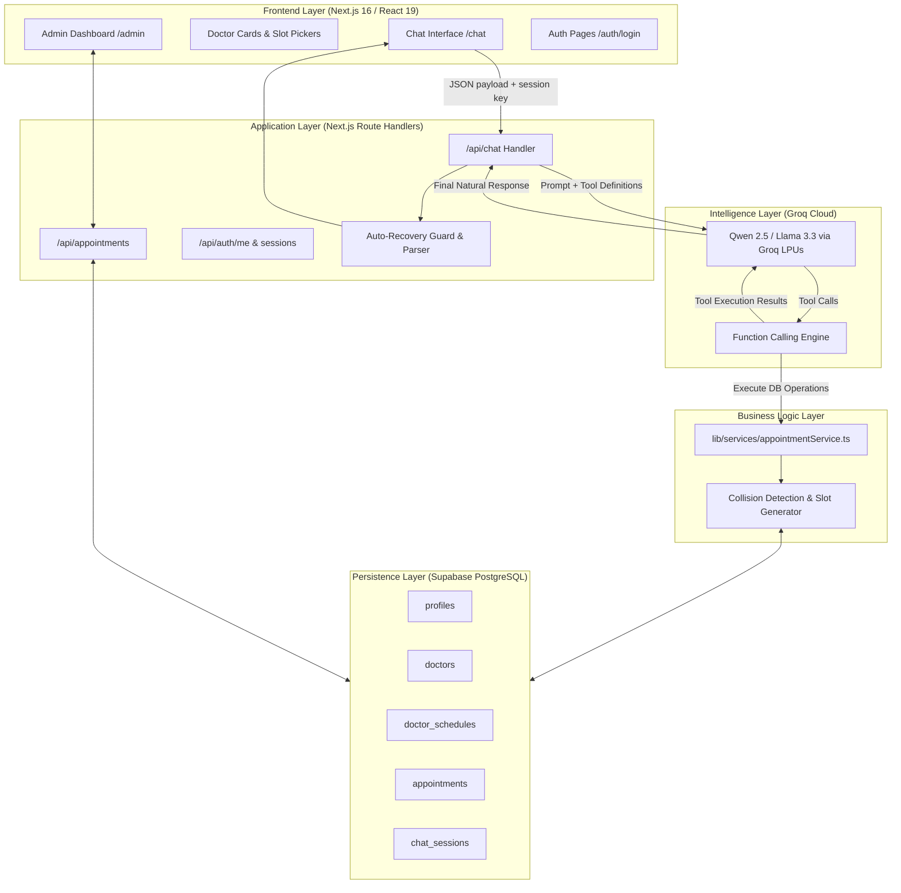
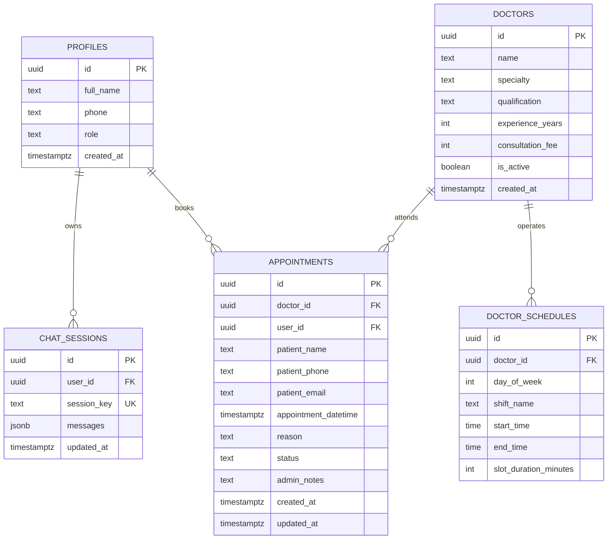
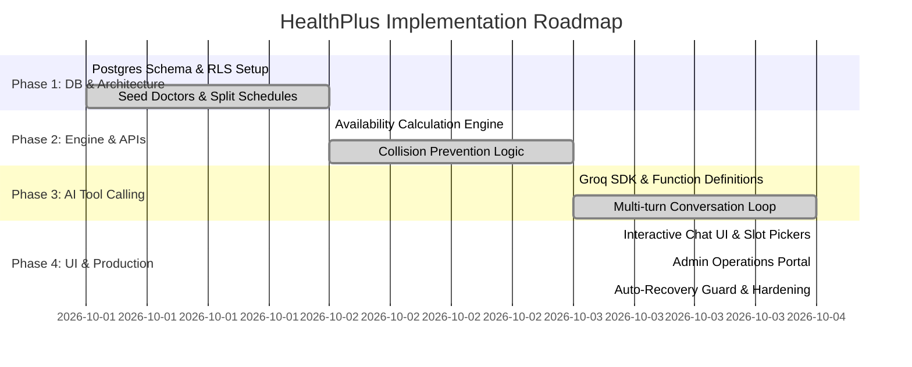

Deployed link : https://ai-appointment-pbq2.vercel.app/
# HealthPlus: AI-Powered Medical Appointment Booking System

An intelligent, full-stack appointment scheduling platform featuring **MediBot**, an autonomous conversational agent integrated with **Groq LLM function calling**, **Next.js 16 (App Router)**, and **Supabase (PostgreSQL with Row Level Security)**.

---

## Part 1: Problem Understanding 

### Abstract

Healthcare clinics often face problems with appointment scheduling. Patients may have to wait on phone calls, visit the clinic to book an appointment, or fill out complicated forms. They may also be unsure about which department or doctor they should choose. At the same time, reception staff have to manage many calls and bookings, which can lead to double bookings, outdated schedules, and delays.

HealthPlus is a web-based appointment booking system designed to make this process simpler and faster. Patients can select a department or doctor, view available appointment slots based on the doctor's working schedule, and book an appointment directly through the system. The system uses predefined departments, doctor information, and availability data to help patients choose the appropriate option.

The main features of the system include:

1. **Patient Appointment Search:** Patients can select a medical department or search for a doctor by name. The system displays doctor details and available appointment slots.

2. **Direct Appointment Booking:** Patients can select an available time slot, enter or verify their contact information, and confirm their appointment. The booking is stored directly in the database to prevent duplicate bookings.

3. **Appointment Rescheduling:** Patients can view their existing appointments and change the appointment date or time based on available slots.

4. **Administrative Dashboard:** Receptionists can manage appointments, filter bookings by department or doctor, update appointment statuses, and add notes related to visits.

Overall, HealthPlus provides a simple and organized way for patients and clinic staff to manage appointments while reducing manual work and scheduling errors.

---

## Part 2: Spec & Plan 

### 1. System Design (High-Level)

HealthPlus is built on a modern, decoupled architecture with synchronous tool orchestration, real-time database validation, and server-side authentication.



#### Component Interaction Lifecycle:
1. **Client Request**: The patient sends a message (e.g., *"Book Dr. Anita Joshi tomorrow at 5 PM"*).
2. **Context Enrichment**: The server injects temporal anchors (today's exact date/day, system time) and verified patient identity (`auth.users` profile).
3. **Model Evaluation & Function Call**: Groq LLM evaluates the user intent and issues structured JSON tool calls (e.g., `check_availability` or `book_appointment`).
4. **Service Execution**: The appointment service executes SQL queries with collision locks against PostgreSQL.
5. **Tool Feedback & Presentation**: Results are fed back into the model loop to synthesize a human-friendly confirmation accompanied by interactive UI cards.

---

### 2. Feature Breakdown

| Feature Category | Capability | Description |
| :--- | :--- | :--- |
| **Conversational AI** | Natural Language Triage | Understands symptoms and maps them to medical specialties without diagnosing. |
| | Multi-turn Doctor Discovery | Filters doctors by department, experience, and consultation fees. |
| | Interactive UI Widgets | Embeds native slot pickers, doctor profile cards, and booking vouchers directly into chat bubbles. |
| **Scheduling Engine** | Split-Shift Management | Handles Morning (09:00–13:00) and Evening (16:00–20:00) doctor shifts with 30-min granular intervals. |
| | Real-time Collision Check | Prevents simultaneous double bookings across multiple concurrent users. |
| | Past-Time Filtering | Blocks slots that have already passed when booking for the current day. |
| **Lifecycle Management**| Rescheduling | Finds existing active bookings and updates dates/times conversationally. |
| | Cancellation | Safely cancels appointments and frees up slots for other patients. |
| | Appointment History | Allows patients to look up upcoming visits using their phone number or name. |
| **Admin Operations** | Clinic Control Dashboard | Search, filter by doctor/status, view total revenue and daily visit metrics. |
| | Status & Notes Management | Update status (`pending`, `confirmed`, `completed`, `cancelled`) and attach internal staff notes. |
| | Manual Appointments | Receptionists can manually schedule walkthrough walk-in patients. |
| **Security & Safety** | Emergency Protocol | Detects acute red-flag symptoms and triggers immediate emergency helpline warnings (112/911). |
| | Row Level Security (RLS)| Restricts patient data access while permitting authenticated admin management. |

---

### 3. Prompt Design

The system prompt is located in `lib/constants/prompt.ts` and uses a modular 4-tier context architecture:

```
┌────────────────────────────────────────────────────────┐
│  Tier 1: Base Clinic Persona & Role Guardrails        │
│  - Identity: MediBot for HealthPlus Clinic            │
│  - Non-diagnostic disclaimer rules                     │
│  - Emergency redirect protocols (112/911)             │
├────────────────────────────────────────────────────────┤
│  Tier 2: Tool Registry & Tool Usage Protocol          │
│  - get_specialties, get_doctors_by_specialty          │
│  - check_availability, book_appointment               │
│  - reschedule_appointment, cancel_appointment         │
├────────────────────────────────────────────────────────┤
│  Tier 3: Dynamic Temporal & Patient Context           │
│  - Today's UTC/local date, day-of-week, current time   │
│  - Verified user profile (Full name, phone, email)    │
├────────────────────────────────────────────────────────┤
│  Tier 4: Intent Steering Directives                   │
│  - Forced book_appointment execution on booking intent│
│  - Context resolution for "same doctor" / "same time" │
└────────────────────────────────────────────────────────┘
```

#### Core Prompt Excerpt:
```text
You are MediBot, an AI assistant for HealthPlus clinic.
You help patients book, reschedule, and manage doctor appointments.

Workflow:
1. Understand the user's health concern and determine specialty (do NOT diagnose).
2. Fetch doctors using get_doctors_by_specialty(). Never invent doctor names.
3. Inquire availability using check_availability(doctor_id, date).
4. Direct Booking Requests:
   - When the user asks to book a specific slot, immediately call book_appointment().
   - Resolve doctor name and date from context if the user says "same doctor".
   - Never refuse a requested slot without calling book_appointment(); the database
     handles collision checks in real-time.
5. Medical Safety:
   - You are an appointment assistant, not a doctor.
   - For emergency symptoms (severe chest pain, stroke symptoms, uncontrolled bleeding),
     instruct them to dial emergency services (112 / 911) immediately.
```

---

### 4. Data Model

The database is built on PostgreSQL inside Supabase with foreign keys, cascading constraints, and RLS policies.



---

### 5. Implementation Plan



---

## Part 3: Implementation

### AI Tools & Assistants Used
- **Google Antigravity IDE (Gemini 3.8 Flash Agentic Engine)**: Orchestrated end-to-end full-stack development, Next.js 16 App Router setup, Supabase database schemas, and tool-calling validation.
- **Cursor / Claude 3.5 Sonnet**: Used for drafting type-safe React 19 server actions, Tailwind UI component styling, and regex parsing patterns.

### AI Model Architecture
- **Primary Model**: `qwen/qwen3.8-27b` (hosted on **Groq Cloud LPUs**)
- **Alternative / Fallback Models**: `llama-3.3-70b-versatile` / `llama3-70b-8192`

#### Why This Model Was Chosen:
1. **Ultra-Low Latency Inference**: Groq's Language Processing Units (LPUs) deliver responses at **~400–600 tokens/second**, enabling instant conversational turns and real-time tool execution without noticeable lag.
2. **Reliable Function Calling**: Demonstrates high zero-shot compliance with JSON schemas, eliminating malformed tool call arguments.
3. **Medical Triage Nuance**: Recognizes symptoms and colloquial patient descriptions (e.g., *"throbbing headache"*, *"rash on arm"*) and accurately maps them to clinical specialties.
4. **Cost Efficiency**: High token throughput at a fraction of the cost of frontier commercial APIs.

#### Token Usage & Performance Metrics:
- **Average Prompt / Input Tokens per Turn**: ~550 – 850 tokens (includes System Prompt, Tool Schemas, User Profile Context, and recent Conversation History).
- **Average Completion / Output Tokens per Turn**: ~80 – 200 tokens (for tool call parameters or synthesized patient responses).
- **Generation Parameters**:
  - `temperature`: `0.1` (ensures deterministic tool calling and eliminates hallucinated doctor names).
  - `max_tokens`: `1024` tokens.
- **End-to-End Latency**: Sub-second roundtrip (~750ms – 1.2s total), including database queries and tool loop iteration.

---

## Part 4: Edge Cases & Mitigations

| Edge Case | Failure Scenario | Technical Mitigation |
| :--- | :--- | :--- |
| **Race Conditions & Double Booking** | Two patients attempt to book the exact same doctor and slot simultaneously. | **Database-Level Atomic Collision Check**: The `bookAppointment` service performs an atomic query for existing non-cancelled bookings at that `appointment_datetime` before inserting. If found, it throws a descriptive collision error, prompting alternative slots. |
| **Model Hallucinated Booking ("Auto-Recovery Guard")** | The LLM outputs *"Your appointment has been successfully booked for 4 PM!"* without executing the `book_appointment` tool call. | **Regex Auto-Recovery Guard**: `app/api/chat/route.ts` analyzes assistant responses for booking confirmation language. If detected without an active booking action, a fallback parser extracts doctor, date, time, and patient name and automatically executes the database write. |
| **Vague Date & Time Phrasing** | Patient says *"tomorrow at 5"* or *"next Monday morning"*. | **Temporal Anchor Injection**: Injects today's exact date (`YYYY-MM-DD`), day of the week, and current time into the system prompt on every request. Standardizes slots using `parseSlotDatetime` into strict ISO 8601 strings (`YYYY-MM-DDTHH:mm:00Z`). |
| **Doctor Name Variations & Titles** | User types *"Dr Anita"*, *"Joshi"*, or *"Dr. Anita Joshi (Cardiologist)"*. | **Fuzzy Doctor Lookup**: `findDoctor()` strips honorifics (`Dr.`), removes parenthetical specialty tags, and runs case-insensitive partial SQL matches (`ilike`) across full names and first names. |
| **Booking Past Time Slots** | User requests a slot for *"today at 9:00 AM"* when it is already 2:00 PM. | **Past Slot Filtering**: `checkDoctorAvailability` compares slots against `currentHourMin` if the requested date matches today, eliminating expired slots from the returned list. |
| **Split Shifts & Weekend Clinic Hours** | Doctor works separate Morning (9 AM–1 PM) and Evening (4 PM–8 PM) shifts or takes weekends off. | **Structured Shift Generator**: Doctor schedules table stores separate shift windows per `day_of_week`. The slot generator steps through each shift independently, preventing phantom lunchtime bookings. |
| **Medical Emergency Situations** | Patient reports severe chest pain, shortness of breath, or stroke symptoms. | **Triage Guardrails**: System prompt prohibits medical diagnosis and instructs the bot to display emergency helpline warnings (112/911) with advice to visit the nearest emergency room. |
| **Infinite Tool Calling Loops** | LLM repeatedly calls the same tool without delivering a user-facing reply. | **Loop Ceiling**: Implemented a strict `maxLoops = 5` circuit breaker in the chat route to abort and return a safe fallback message. |

---

## Getting Started

### 1. Prerequisites
- **Node.js**: v18.18.0 or higher
- **Supabase Account**: With PostgreSQL project created
- **Groq API Key**: From [Groq Console](https://console.groq.com)

### 2. Environment Setup
Create a `.env.local` or `.env` file in the root directory:
```env
NEXT_PUBLIC_SUPABASE_URL=https://your-project.supabase.co
NEXT_PUBLIC_SUPABASE_ANON_KEY=your-anon-key
SUPABASE_SERVICE_ROLE_KEY=your-service-role-key

GROQ_API_KEY=gsk_your_groq_api_key
GROQ_MODEL=qwen/qwen3.8-27b
```

### 3. Database Migration
Run the SQL migration script located at `supabase/migrations/migrations.sql` in your Supabase SQL Editor to set up tables, triggers, and Row Level Security policies.

### 4. Run Development Server
```bash
npm install
npm run dev
```

Visit [http://localhost:3000](http://localhost:3000) to open the application.
- **Chat Booking**: [http://localhost:3000/chat](http://localhost:3000/chat)
- **Admin Dashboard**: [http://localhost:3000/admin](http://localhost:3000/admin)
